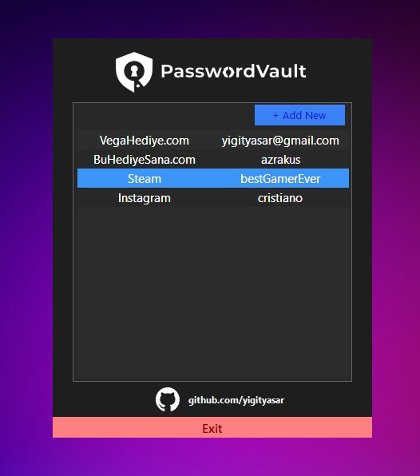
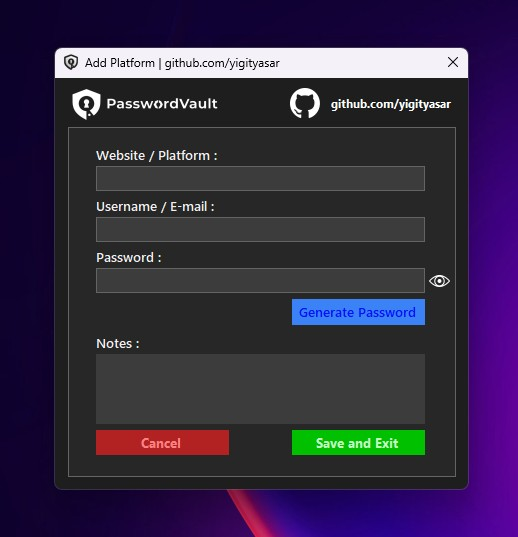
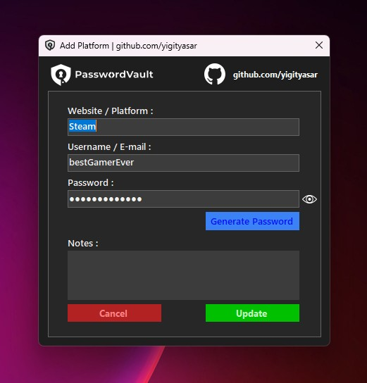

# PasswordVault v1.0

**PasswordVault** is a modern, dark-themed password manager built with **C# WinForms**.  
Securely store your passwords, usernames, websites, and notes. Passwords are encrypted and saved in JSON format.

---

## Features
- Add, edit, and delete password entries
- Creating strong passwords
- Masked passwords with show/hide toggle
- Hover effects and clean modern UI inspired by VSCode
- Optional notes for each entry
- Fully dark-themed interface for a sleek look

---

## Screenshots
<table align="center">
  <tr>
    <td align="center">
       
      PasswordVault | MainForm UI
    </td>
  </tr>
</table>

<table align="center">
  <tr>
    <td align="center">
       
      PasswordVault | AddForm UI
    </td>
    <td align="center">
       
      PasswordVault | AddForm Update UI
    </td>
  </tr>
</table>

---

## Installation
1. Download the `setup.exe` file from the [Release page](https://github.com/yigityasar/PasswordVault/releases/download/v1.0/setup.exe)
2. Run the `setup.exe` to install PasswordVault
3. During installation, a desktop shortcut and Start Menu entry will be created
4. Launch PasswordVault from the desktop or Start Menu and start managing your passwords securely

---

## Usage
- Click **New Password** to add a password entry
- Double-click an entry to edit it
- Right-click an entry to delete it

---

## License
This project is licensed under the **MIT License**.
